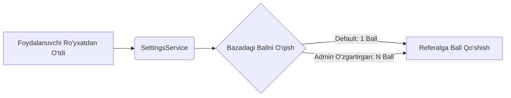

Mana loyihangiz uchun barcha bo'limlarni, vizual sxemalarni, `mermaid` diagrammasini va grafik interfeyslarni o'z ichiga olgan **to'liq professional `README.md**` fayli. Buni to'g'ridan-to'g'ri loyihangizning asosiy katalogiga joylashtirishingiz mumkin:

```markdown
# 🤖 yoshkitobchibot — Tizim Yangilanishlari & Arxitektura

<p align="center">
  
  
  
</p>

---

## 🚀 Yangi Funksiyalar va Konfiguratsiya

### 📌 1. Dinamik Referal Ball Tizimi
* **Fayl:** `database/services/settings_service.py` 🆕
* **Logika:** `user_service.py` ichidagi `complete_registration()` funksiyasi endi statik qiymat emas, balki `SettingsService` orqali bazadagi joriy ballni dinamik o'qiydi.
* **UI Ekrani:** Foydalanuvchining **Targ'ibot** sahifasida joriy ball qiymati (`+N ball`) real vaqtda yangilanib turadi.



### 📌 2. Profil Ma'lumotlarini Tahrirlash

* **Fayl:** `app/handlers/users/menu.py` 🔄
* **Imkoniyat:** Profil menyusiga yangi `✏️ Ma'lumotlarni o'zgartirish` inline-tugmasi qo'shildi (`profile_edit_keyboard()`).
* **Tahrirlash bloklari:**
* 👤 **F.I.Sh.** (To'liq ism-sharif)
* 🏢 **Ish/o'qish joyi** (Muassasa nomi)
* 📍 **Mahalla** (Yashash hududi)


### 📌 3. Kengaytirilgan Test Boshqaruvi

* **Fayl:** `app/handlers/admins/tests/test_admin.py` 🆕
* **Admin panel orqali to'liq nazorat:**
* `✅ / 🔴` **Status Toggle:** Testlarni bir marta bosish bilan yoqish yoki o'chirish.
* `🗑 Sessiyalarni tozalash:` Foydalanuvchilar testni qaytadan topshira olishlari uchun eski urinishlarni o'chirish.
* `📊 Statistika:` Har bir test bo'yicha jami boshlangan va muvaffaqiyatli tugatilgan sessiyalar hisoboti.


### 📌 4. Konkurs (Musobaqa) Moduli

* **Fayl:** `app/handlers/admins/contest.py` 🔄
* **Boshqaruv:** Yangi konkurs yaratish (nomi, tavsifi, min. referal) hamda start (`▶️`) / stop (`⏹`) tugmalari.
* **Algoritm:** Shartlarni bajargan ishtirokchilar ro'yxatidan adolatli `🎲 Random` g'olib aniqlash tizimi.
* **Avtomatlashtirish:** Aktiv konkurs bo'lganda, foydalanuvchining **Targ'ibot** bo'limi avtomatik ravishda **Konkurs Rejimi**ga o'tadi.

### 📌 5. Dinamik Tugmalar & Maqsadli Broadcast

* **Fayl:** `app/handlers/admins/buttons/button_admin.py` 🆕
* **Dinamik Tugma:** Bot ichida admin tomonidan `🔗 URL Havola` yoki `💬 Xabar matni` tugmalarini yaratish va boshqarish (`🟢/🔴`).
* **Target-Broadcast:** Botga start bosgan, biroq hali **ro'yxatdan o'tmagan** foydalanuvchilarga yo'naltirilgan xabarnomalar.
* **Progress Tracking:** Har 20 ta yuborilgan xabarda admin ekrani real vaqtda yangilanadi va yakuniy statistika chiqariladi.

---

## 📁 Loyiha Strukturasi (Handlers)

Kod bazasi modullilik va tozalik (Clean Architecture) prinsiplari asosida quyidagicha shakllantirildi:

```🗂 Loyiha Katalogi
app/
└── handlers/
    ├── 👤 users/
    │   ├── 🔹 start.py         # Botni ishga tushirish & referal triggeri
    │   ├── 🔹 register.py      # Bosqichma-bosqich ro'yxatdan o'tish
    │   ├── 🔹 menu.py          # Profil, reyting va targ'ibot menyulari
    │   ├── 🔹 test.py          # Test topshirish va taymer logikasi
    │   ├── 🔹 help.py          # Yo'riqnoma va ko'mak
    │   └── 🔹 prizes.py        # Sovrinlar ro'yxati
    │
    └── 👑 admins/
        ├── 🔸 main_admin.py    # Asosiy admin boshqaruv paneli
        ├── 🔸 users.py         # Foydalanuvchilar bazasi va qidiruv
        ├── 🔸 contest.py       # Konkurs va Randomizer moduli
        ├── 🔸 settings_admin.py# Tizim sozlamalari paneli 🆕
        ├── 🔸 ads/             # Reklama menejmenti
        ├── 🔸 channels/        # Majburiy obunalar nazorati
        ├── 📁 tests/
        │   └── 🔹 test_admin.py# Test sozlamalari va statistikasi 🆕
        └── 📁 buttons/
            └── 🔹 button_admin.py # Dinamik tugmalar va target-broadcast 🆕

```

---

## ⚙️ Markazlashtirilgan Sozlamalar

`Admin Panel ➡️ ⚙️ Sozlamalar` bo'limidagi sozlamalarning vizual ko'rinishi:

```⚙️ Tizim Konfiguratsiyasi (BotSettings)
┌──────────────────────────────┬──────────────────────────────┐
│  🎯 Referal Balli            │  📝 Maksimal Savollar        │
│  └─ Standart: 1 ball         │  └─ Standart: 40 ta          │
├──────────────────────────────┼──────────────────────────────┤
│  ⏱ Savol Taymeri            │  🗞 Targ'ibot Matni          │
│  └─ Standart: 90 soniya      │  └─ Maxsus kontent (HTML)    │
└──────────────────────────────┴──────────────────────────────┘

```

---

## 🗄 Ma'lumotlar Bazasi Migratsiyasi

Yangi jadvallarni (`bot_settings`, `custom_buttons`) tizimga xavfsiz qo'shish uchun quyidagi buyruqni ishga tushiring:

```bash
python3 migrate.py

```

> ⚠️ **Xavfsizlik kafolati:** Migratsiya mavjud ma'lumotlarga va foydalanuvchilar bazasiga zarar yetkazmaydi, faqat yangi strukturalarni tizimga integratsiya qiladi.

---

## 🖥 Admin Panel Interfeysi (UI Layout)

Adminlar uchun boshqaruv klaviaturasi interfeysi grafik ko'rinishda quyidagicha loyihalashtirildi:

```🕹 Admin Panel Boshqaruv Ekranlari
┌─────────────────────────────────────────────────────────────┐
│                       📊 STATISTIKA                         │
├──────────────────────────────┬──────────────────────────────┤
│  🔐 Kanallar                 │  📋 Testlar Ro'yxati         │
├──────────────────────────────┼──────────────────────────────┤
│  👥 Foydalanuvchilar         │  🏆 Konkurs Moduli           │
├──────────────────────────────┼──────────────────────────────┤
│  🔘 Tugmalar Boshqaruvi      │  ⚙️ Tizim Sozlamalari        │
├──────────────────────────────┴──────────────────────────────┤
│                     📨 XABAR YUBORISH (ADS)                 │
└─────────────────────────────────────────────────────────────┘

```

```

```
